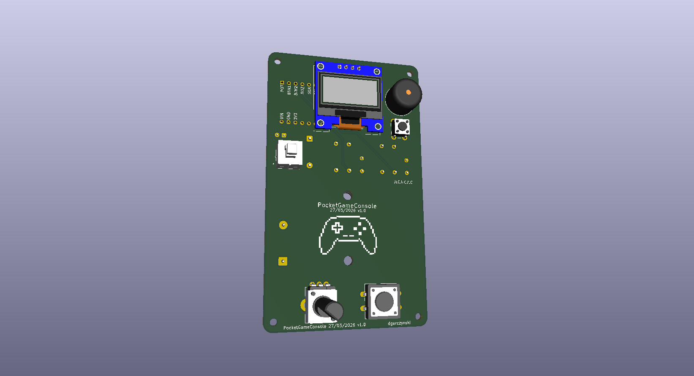
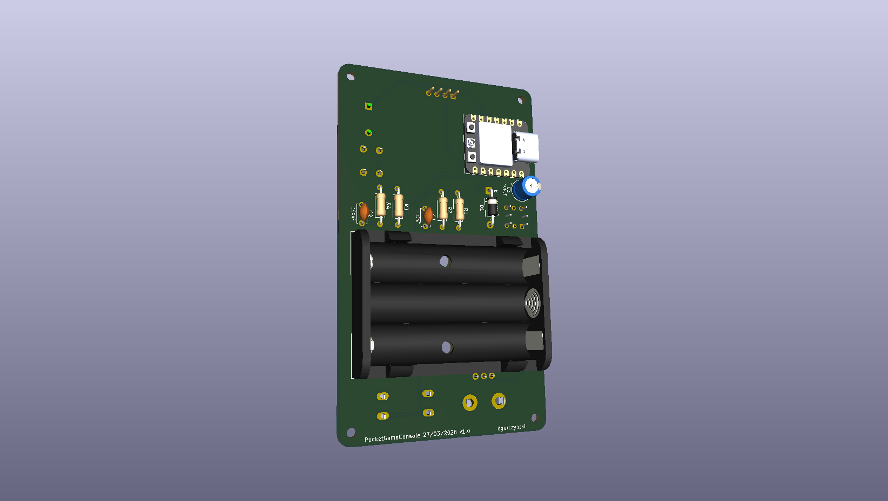

# PocketGameConsole (ESP32-C3)

Przenośna mini-konsola oparta na układzie **ESP32-C3** z wyświetlaczem OLED 0.96". 

## O projekcie
To mój **pierwszy w życiu projekt PCB**, wykonany w całości w programie KiCad. Skupiłem się w nim na:
* Sprzętowym debouncingu przycisków (filtr R-C).
* Czytelnym opisie warstw (Silkscreen) i estetyce logotypu.
* Bezpiecznym zasilaniu bateryjnym (dioda Schottky'ego).

## Zawartość repozytorium
* **[Software](src/):** Kod źródłowy C++ (PlatformIO).
* **[Schemat PDF](hardware/PocketGameConsole.pdf):** Pełna dokumentacja ideowa.
* **[Gerber ZIP](hardware/gerbers/PocketGameConsole_Gerbers.zip):** Pliki gotowe do zamówienia w fabryce.
* **[Projekt KiCad](hardware/pcb_project/):** Pliki źródłowe płytki.

### Podgląd 3D

